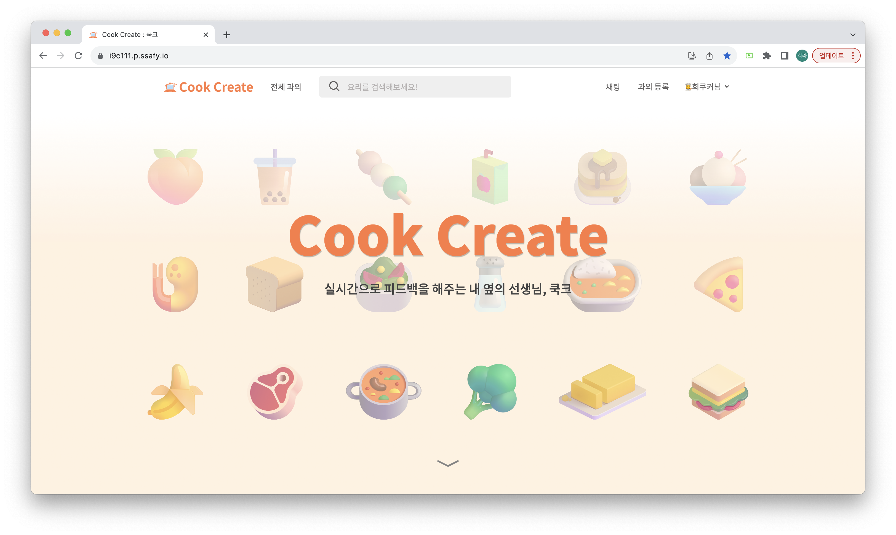
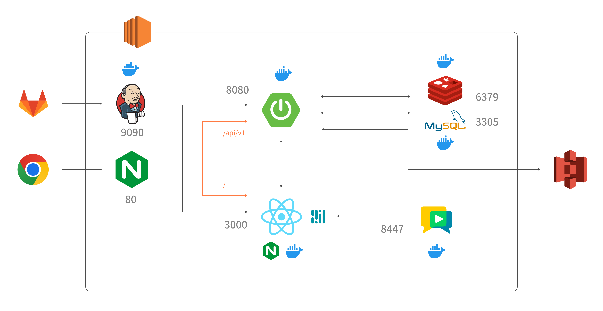
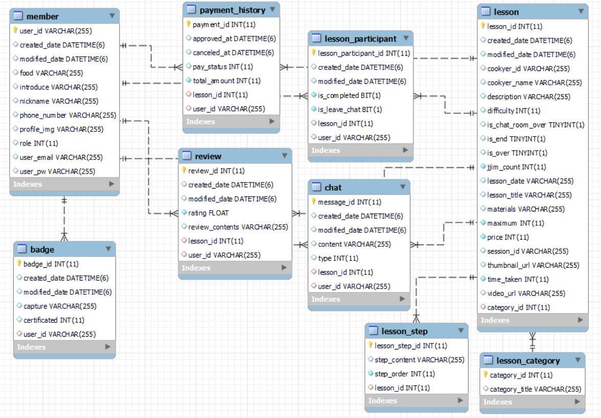

# 🍳CookCreate🍳

<div align="center">
23.07.04 ~ 23.08.18(7주)<br/>
🏆우수 프로젝트 선정🏆<br/><br/>
</div>

## 🍪 서비스 소개 🍪

<div align="center">
<b>함께 요리하고, 도움이 필요하면 바로 손을 드세요!🙋</b><br/><br/>



CookCreate는 손들기, 체크, 타이머 등의 제스처 인식을 통해 <br/>
사용자 경험을 개선한 <strong>실시간 피드백 요리 화상 과외 서비스</strong>입니다. <br/><br/>
CookCreate와 함께 맛있는 집밥을 만들어보세요!

[> UCC 보러가기 <](https://youtu.be/q4hc7BR35PQ)

</div>

## 🍪 서비스 특징 🍪

1. WebRTC를 활용한 실시간 화상 과외를 이용할 수 있습니다.
2. 화상 과외 내에서 AI 제스처 인식을 통해 요리 중에도 편리하게 상호작용 할 수 있습니다.
3. 화상 과외 시간 외에도 선생님과 학생들이 그룹 채팅을 통해 소통할 수 있습니다.

## 🍪 주요 기능 🍪

### 화상 과외

- 선생님은 예정 과외 시간의 한 시간 전부터 화상 과외 시작이 가능합니다. 학생은 선생님이 화상 과외를 시작했을 때 입장이 가능합니다.
- 화상 과외 화면에서는 선생님이 사전 입력한 과외 진행 단계가 표시됩니다. 학생들은 진행단계를 통해 요리를 하는 동시에 현재 수업의 진행 사항을 원활하게 따라갈 수 있습니다.
- 선생님은 화면 공유를 통해 사전 제작된 수업 영상을 학생들에게 공유할 수 있습니다.

### 핸즈프리 제스쳐

- `손들기` : 선생님의 도움이 필요한 학생은 ✋🏻 제스쳐를 할 수 있습니다. 선생님은 손 든 순서대로 학생들을 볼 수 있고, 손들기를 해제할 수 있습니다.
- `체크` : 수업의 현재 진행 단계를 마친 학생은 ✔️ 제스쳐를 통해 자신이 현재 단계를 완료했다는 사실을 알릴 수 있습니다. 선생님은 학생들의 진행 단계 현황을 보고 유연하게 수업을 진행할 수 있습니다.
- `타이머` : 수업 도중 타이머가 필요할 때 👌🏻 제스쳐를 통해 타이머를 시작할 수 있습니다.

### 채팅

- 과외 전후로 그룹 채팅방을 이용하여 공지 및 질의응답을 할 수 있습니다.
- 선생님이 채팅방을 나가면 그룹 채팅이 종료됩니다.

## 🍪 기능별 화면 🍪


#### [> 기능별 화면 GIF 보러가기 <](./exec/CookCreate-UI.md)

## :fork_and_knife: 사용한 외부 서비스

- [Openvidu 플랫폼](https://docs.openvidu.io/en/2.28.0/)
- [카카오페이 API](https://developers.kakao.com/docs/latest/ko/kakaopay/common)

## :fork_and_knife: 시스템 아키텍쳐



## :fork_and_knife: ERD 다이어그램



## :fork_and_knife: 문서 링크

- [MMT 팀의 노션](https://cottony-brass-90a.notion.site/23bd4357ec2e4df2a96beefb5d1cdd2a?pvs=4)
- [기능명세서](https://cottony-brass-90a.notion.site/09ff28d6d1be43aabeea159add36e0c5?pvs=4)
- [API 명세서](https://cottony-brass-90a.notion.site/API-46e6beb14a7f4c8d8dfb231df9d88db4?pvs=4)
- [와이어프레임](https://www.figma.com/file/V1fbyTIiFd3kYydQngyD1S/%ED%99%94%EB%A9%B4%EC%84%A4%EA%B3%84%EC%84%9C?type=design&node-id=16%3A2&mode=design&t=YFBSrXVlptJfM2yB-1)
- [UI 디자인](https://www.figma.com/file/V1fbyTIiFd3kYydQngyD1S/%ED%99%94%EB%A9%B4%EC%84%A4%EA%B3%84%EC%84%9C?type=design&node-id=582%3A423&mode=design&t=YFBSrXVlptJfM2yB-1)

## 🧈 Git-flow 🧈

- 기능 개발이 완료되면 feature branch를 develop branch로 merge한다.

- branch 규칙

  > master : 운영 서버로 배포하기 위한 branch<br/>
  > develop : 다음 출시 기능을 개발하는 branch<br/>
  > back : backend branch<br/>
  > front : frontend branch<br/>
  > feature : 세부 기능을 개발하는 branch, branch 이름은 각 기능명으로 작성<br/>
  > hotfix : 급한 에러 수정

- feature branch 이름 규칙
  > feature/[front or back]/[기능명]<br/>
  > ex) feature/back/member<br/>
  > ex) feature/front/webrtc

## 🧈 commit conventions 🧈

### 형식

- 커밋 타입: 내용 자세히 적어주기 [#지라이슈넘버]<br/>
- ex) FEAT: 로그인 rest api 추가 [#지라이슈넘버]<br/>
- git commit -m "[커밋타입] 커밋메세지 #프로젝트번호-JIRA이슈번호"<br/>

### 타입

> FEAT: 새로운 기능 및 파일을 추가할 경우<br/>
> MODIFY: 기능을 변경한 경우<br/>
> STYLE: 간단한 수정, 코드 변경이 없는 경우<br/>
> FIX: 버그를 고친 경우<br/>
> DOCS: 문서를 수정한 경우(ex> Swagger, README)<br/>
> COMMENT: 주석 추가/삭제/변경한 경우<br/>
> RENAME: 파일 혹은 폴더명 수정 및 이동<br/>
> DELETE: 파일 혹은 기능 삭제<br/>
> CHORE: 빌드 업무 수정(ex> dependency 추가)<br/>
> REFATOR: 프로덕션 코드 리팩토링<br/>
> MERGE: 충돌 시 머지, develop 브랜치에 풀리퀘 등

## 🧈 JIRA 규칙 🧈

**EPIC**

> EPIC내에 해당하는 STORY와 TASK 생성<br/>
> 회원 관리, 과외 모집, 리뷰, 화상 과외, 결제, 채팅, 기획 설계, 배포

**STORY**

> 사용자 입장에서 작성<br/>
> ex) 사용자는 로그인을 할 수 있다.

**TASK**

> TASK는 STORY에 링크된 이슈로 생성<br/>
> BE, FE, 설계, CSS로 나눠서 작성<br/>
> ex) [BE] 로그인 API 구현, [FE] 로그인 페이지 구현, [설계] 로그인 ERD 작성

## 🧈 폴더 구조 🧈

<details>
<summary>backend</summary>

```bash
  ├─ main
  ├─ config
  ├─ controller
  ├─ common
  │  └─ auth
  ├─ domain
  │  ├─ entity
  │  ├─ request # dto
  │  └─ response # dto
  ├─ repository # dao
  │  └─ impl
  └─ service # 서비스
     └─ impl<br/>
```

</details>
<details>
<summary>frontend</summary>

```bash
  ├── docker
  ├── node_modules
  ├── public
  └── src
      ├── assets # image
      ├── components
      ├── pages
      ├── store # redux
      └── style # css
```

</details>

## ✨ 팀원 소개 ✨

<div align="center">

| [](https://github.com/byunyc0124) | [](https://github.com/Phabala) | [](https://github.com/jjoyra) |
| :-------------------------------------------------------------------------------------------------------------: | :----------------------------------------------------------------------------------------------------------: | :---------------------------------------------------------------------------------------------------------: |
|                                                     변영채                                                      |                                                    김기홍                                                    |                                                   조희라                                                    |
|                                                    BE, 팀장                                                     |                                                      AI                                                      |                                                     BE                                                      |

| [](https://github.com/suwon205) | [](https://github.com/yeeeeeji) | [](https://github.com/tsmich926) |
| :------------------------------------------------------------------------------------------------------------: | :------------------------------------------------------------------------------------------------------------: | :------------------------------------------------------------------------------------------------------------: |
|                                                     양수원                                                     |                                                     윤예지                                                     |                                                     황수아                                                     |
|                                                       FE                                                       |                                                       FE                                                       |                                                       FE                                                       |

</div>

## ✨ 맡은 역할 ✨

<strong>김기홍</strong>

- 기능명세서 문서화 작업
- 객체탐지 로직 설계를 통한 제스처 탐지 기능 구현
- React-Redux를 활용해 MediaPipe와 OpenVidu 연결
- Docker를 활용한 OpenVidu 서버 배포
- 마이페이지 CSS

<strong>변영채</strong>

- 기능명세서, API 명세서, 노션 등의 문서화 작업
- Spring Security, JWT, Redis를 활용한 회원가입/로그인 API
- 과외 글/리뷰 CRUD API와 마이페이지 API 개발
- Spring boot에 S3를 연동하여 프로필, 썸네일, 자격증 등의 이미지를 업로드
- Docker를 활용한 EC2 환경에서의 배포
- 과외 등록 및 조회, 모달 CSS
- 최종 발표

<strong>양수원</strong>

- 화면설계서 문서화 작업
- React를 활용하여 회원가입, 로그인, 메인 화면, 검색 기능, 과외 CRUD 구현
- KakaoPay 결제 api를 이용하여 redirect 처리하여 과외 신청 및 환불 구현
- Redux Toolkit을 사용한 스토어 구축
- 과외 수정 및 404 페이지 CSS
- 기획 발표

<strong>윤예지</strong>

- 화면설계서 문서화 작업
- OpenVidu를 이용한 화상과외방 생성 및 종료 기능 구현
- OpenVidu를 이용한 화상과외방 상호작용 기능 구현
- Redux Toolkit 및 Redux Persist 라이브러리를 이용한 스토어 구축
- 화상과외방 및 모달, 레시피북 CSS
- UCC 제작

<strong>조희라</strong>

- 기능명세서, API 명세서, 노션 등의 문서화 작업
- Spring Security를 활용한 회원 조회 및 수정 API 개발
- WebSocket, stompjs, Redis를 이용한 채팅 API 개발
- KakaoPay API를 이용한 결제 API 개발
- Docker, Jenkins를 활용한 EC2 환경에서의 CI/CD
- 서비스 UI 디자인
- 메인페이지 CSS

<strong>황수아</strong>

- 화면설계서 문서화 작업
- React를 활용하여 회원 정보 수정 구현, 강의상세페이지 구현
- stompjs를 활용한 채팅 client 구현, 채팅 CSS
- React를 활용하여 마이페이지의 과외 목록, 레시피북, 결제내역 목록 구현
- React, 모달을 이용한 리뷰 CRUD 구현
- Redux Toolkit을 사용한 스토어 구축
