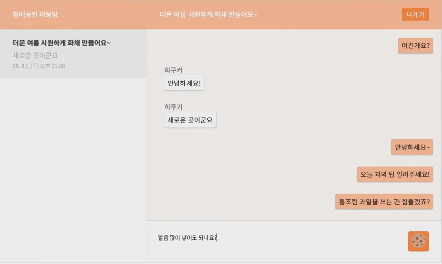
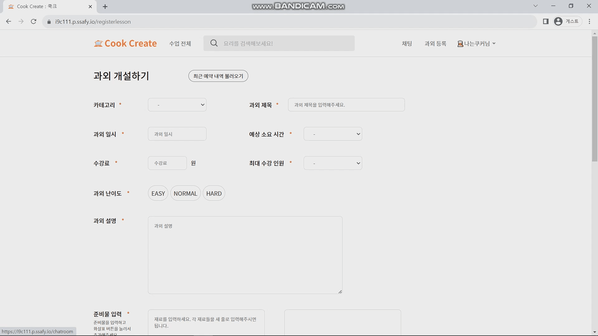
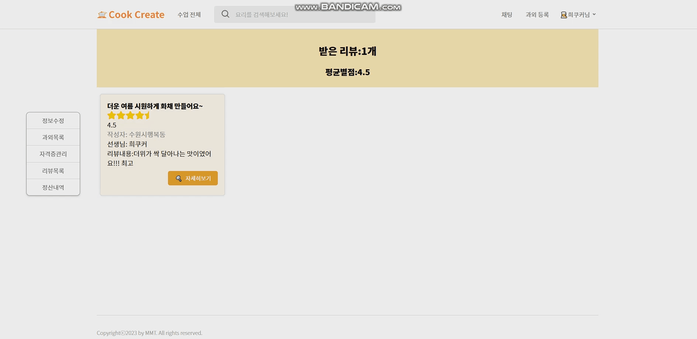
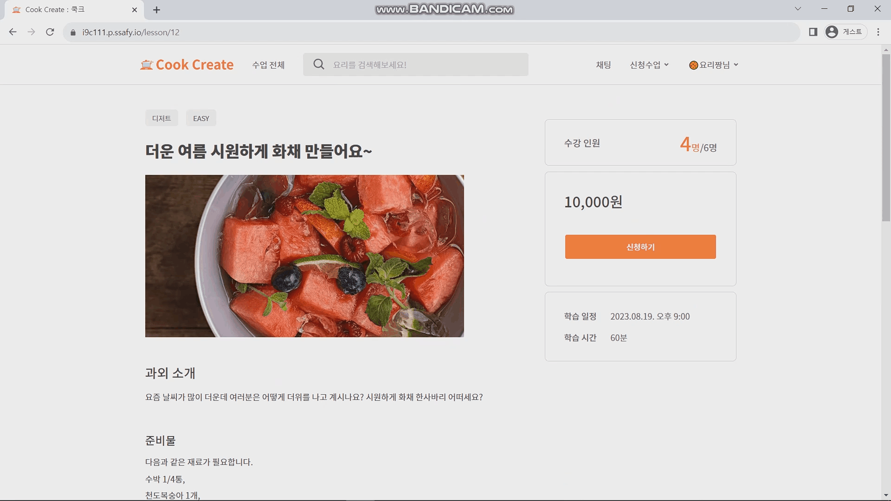
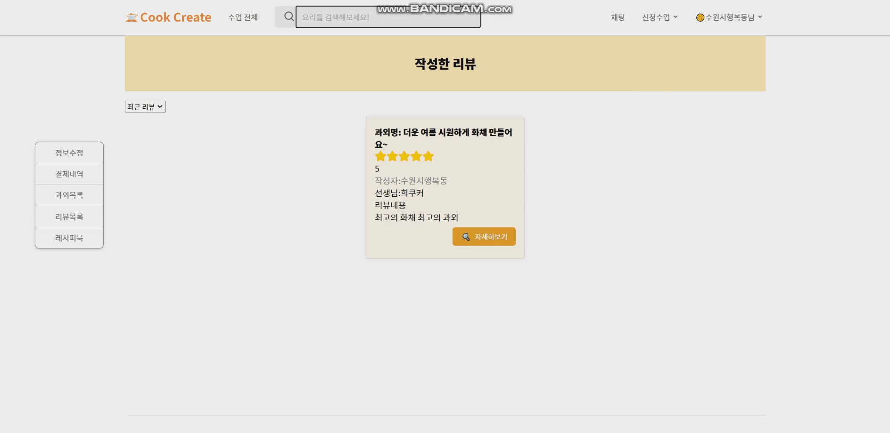

# CookCreate UI

### 👩 공통 

#### 메인 페이지

#### 핸즈프리 제스처 테스트

#### 채팅

### 👩‍🍳 Cookyer 선생님

#### 과외 등록

#### 직전 과외 불러오기

#### 과외 수정

#### 화상 과외

#### 화면공유

#### 받은 리뷰 조회

#### 마이페이지

### 👩‍🍳 Cookiee 학생

#### 과외 신청

#### 핸즈프리 제스처

#### 리뷰 작성

#### 리뷰 수정

#### 마이페이지
